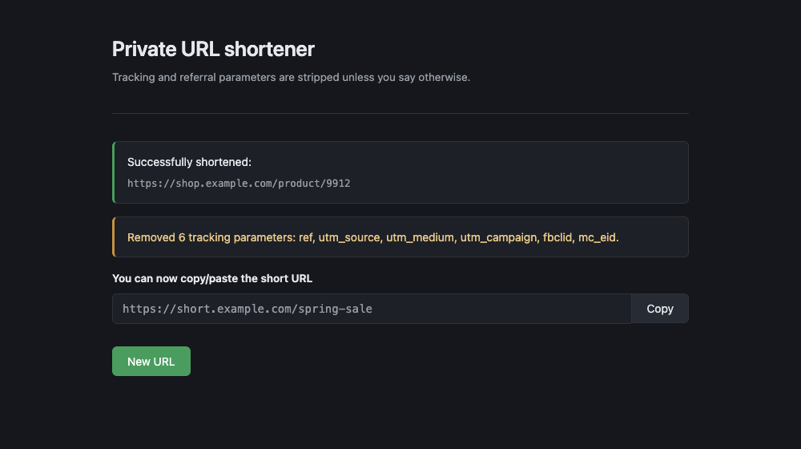
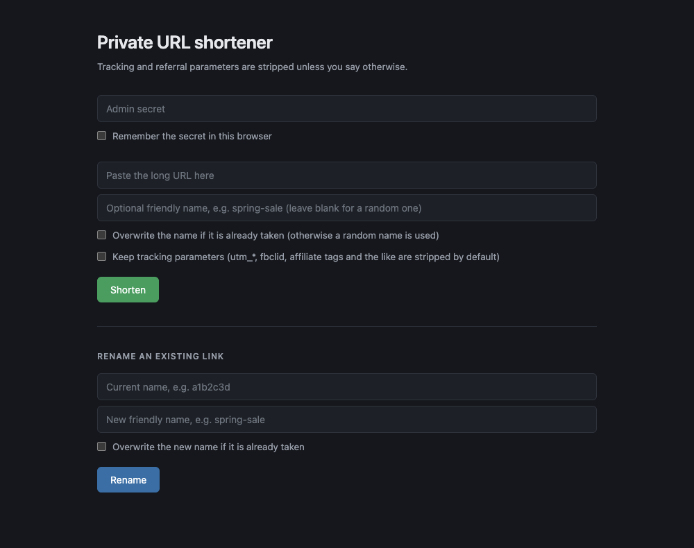

# shorturl

A private URL shortener on Lambda, S3 and API Gateway. Links are S3 objects
carrying a `WebsiteRedirectLocation`, so a redirect costs one `head_object` and
nothing runs between requests.

It strips tracking and referral parameters before storing the link.

```
https://example.com/p?id=42&utm_source=news&fbclid=abc
  -> https://example.com/p?id=42
     Removed 2 tracking parameters: utm_source, fbclid.
```



## Layout

| Path | What |
|---|---|
| `src/shortener/` | Creates and renames links. Holds the cleaning logic |
| `src/redirector/` | Looks up a key and returns a 302 |
| `src/web/admin.html` | The admin page, served from a mock integration |
| `tools/refresh_tracking_params.py` | Regenerates the upstream parameter list |
| `template.yaml` | The stack |
| `deploy.sh` | Package, deploy, push the admin page |

## Deploy

Needs the AWS CLI with credentials, `python3`, `zip` and `openssl`.

```
./deploy.sh
```

It creates a bucket for the packaged code, deploys the stack, pushes
`src/web/admin.html` into the `/admin` integration response, and prints the
URLs. On a first deploy it generates an admin secret and prints it once.

The stack mirrors a deployment that has been running in production, and the
template validates, but it has not been raised from scratch. Open an issue if a
fresh deploy trips on something.

| Variable | Default |
|---|---|
| `STACK_NAME` | `shorturl` |
| `AWS_REGION` | your CLI default, else `us-east-1` |
| `STAGE_NAME` | `prod` |
| `ADMIN_SECRET` | reuses the deployed value, generates one on a first deploy |
| `ARTIFACTS_BUCKET` | `<stack>-artifacts-<account>-<region>` |

Rotate the secret by redeploying with a new one. It takes effect on the next
invocation, with no cache invalidation and no page refresh.

```
ADMIN_SECRET="$(openssl rand -base64 32)" ./deploy.sh
```

Changing only `src/web/admin.html` still needs a full `./deploy.sh`, because the
page lives in an API Gateway integration response rather than in the bucket.

## Admin page



`/admin` shortens a URL, optionally under a name you pick, and renames existing
links. The secret goes in the field at the top and can be remembered in
`localStorage`.

Leave the name blank for a random 7-character key. If a name is taken and the
overwrite box is unticked, shortening falls back to a random key and says which
one it used. A rename in that position refuses instead: falling back would
delete the original and hand you a name you never asked for.

## Cleaning

Three layers, because no single source is enough. Brave, AdGuard and ClearURLs
were all checked. None carry `fb_cid`, `fb_asid`, `fb_aid` or most of the
AppsFlyer `af_` family, so a maintained list on its own still leaks.

1. Upstream names. `src/shortener/tracking_params.py` holds AdGuard's
   globally-scoped `$removeparam` rules. Only the global ones. AdGuard scopes
   `ref`, `tag`, `source`, `campaign`, `pid` and `c` to named domains because
   they are ordinary parameters elsewhere, and applying those everywhere breaks
   destinations.
2. Prefix families. `utm_`, `af_`, `fb_`, `pk_`, `mtm_`, `hsa_`, `_branch_`.
   This is the layer that catches what upstream misses, and a new member of a
   family needs no list update.
3. Conditional names. `pid`, `c` and `placement` come off only when the
   query also carries an unmistakable ad parameter. Brave does the same in
   `kConditionalQueryStringTrackers`. So an AppsFlyer link collapses to its
   origin while `shop.example.com/item?pid=88512` is left alone.

The query string is filtered by splitting on `&`, not by round-tripping through
`parse_qsl` and `urlencode`. Surviving parameters keep their original
percent-encoding, and a URL with nothing to strip comes back byte for byte.

Fragments are not touched. Renames are not cleaned either: the target comes from
the stored object, and a rename should not quietly change where a link points.

`src/shortener/clean_url.py` also carries an aggressive set inherited from
[laststance/clean-url](https://github.com/laststance/clean-url): `ref`, `tag`,
`source`, `campaign`, `trk`, `referrer` and others. AdGuard's judgement is that
these are safe only per-domain. Drop them from `TRACKING_PARAMS` if you would
rather keep junk than risk a link landing somewhere else. Either way the result
panel names every parameter it removed, so a wrong strip shows up when you make
the link rather than when someone clicks it.

Refresh the upstream layer:

```
python3 tools/refresh_tracking_params.py
python3 tests/test_clean_url.py
```

The generator refuses to write if it parses fewer than 200 names, so a change in
the upstream format fails loudly instead of emptying the list.

## Tests

No framework. Both files are plain scripts that exit non-zero on failure.

```
python3 tests/test_clean_url.py
python3 tests/test_shortener_cleaning.py
```

`test_shortener_cleaning.py` stubs `boto3` and `botocore` in `sys.modules`, so
it needs no credentials and no network.

## Custom domain

The stack stops at the API Gateway URL. To put a domain in front, point
CloudFront at the API Gateway origin and add an ACM certificate.

Two things that cost time:

- CloudFront caches `/admin`. A wildcard `--paths '/*'` invalidation has been
  seen to report `Completed` while the old page kept being served. Invalidate
  the exact path.
- If the distribution keeps `QueryString: False`, then `/admin?x=1` and `/admin`
  are one cache entry, so a cache-busting query string does nothing.

Behind a proxy such as Cloudflare, compare the domain against the CloudFront
URL directly to find which layer is stale. Response size tells them apart: the
origin body is exactly the byte count of `src/web/admin.html`.

## Known gaps

- No rate limiting on `POST /admin_shrink_url`. One shared secret is the only
  thing in front of it.
- The admin page is public. Anyone can load it; they just cannot write.
- Bot protection on a proxy in front of this will challenge non-browser clients
  and break link unfurls in chat apps.
